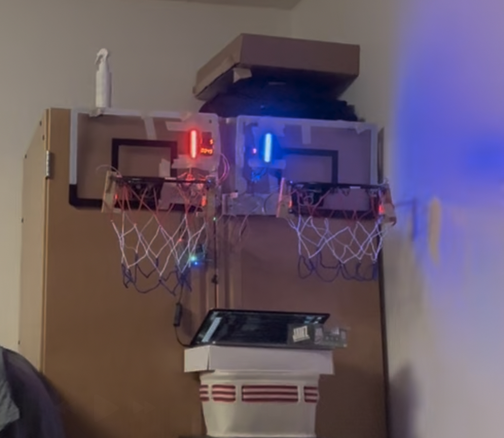

# Mango Pi Basketball Arcade

**Bare-metal arcade game on RISC-V** — A "pop-a-shot" style basketball game running entirely on a [Mango Pi](https://mangopi.org/) board with no OS: custom drivers, GPIO interrupts, dual SPI (hardware + bit-banged), and real-time scoring.

---

## Overview

This project is a two-hoop basketball arcade game built for the **Stanford CS107e** (Computer Systems from the Ground Up) ecosystem. The game runs **bare-metal in C on a RISC-V Mango Pi**, using only GPIO, timers, and custom drivers—no Linux, no Arduino runtime. Two IR beam-break sensors detect shots and score 1 or 2 points based on how long the beam is blocked; dual 7-segment scoreboards, dual DotStar LED strips, and a piezo buzzer provide feedback. A second game mode periodically swaps which hoop scores for which team, with LED colors and scoreboards updating in real time via timer interrupts.

---

## Demo

| Gameplay | Hardware setup |
|----------|----------------|
|  |  |

---

## Features

- **Two game modes**  
  - **Standard:** Red hoop = Red team, Blue hoop = Blue team.  
  - **Switching:** Every 5 seconds, hoop assignments swap; LEDs and scoreboards update live via timer interrupt.

- **IR-based scoring**  
  - Two IR obstacle/beam-break sensors (one per hoop).  
  - **1 point** vs **2 points** decided by obstruction duration (e.g. &lt; 65 ms → 2 pts, else 1 pt), with short glitches filtered out.

- **Dual LED strips (APA102/DotStar)**  
  - One strip on **hardware SPI**, one on **software (bit-banged) SPI** on separate GPIO pins.  
  - Team colors (red/blue) per hoop; victory/tie animations (flashing red, blue, or purple).

- **Dual TM1637 4-digit scoreboards**  
  - One per team; scores update immediately on basket.  
  - Separate **countdown display** with MM:SS countdown for game time.

- **Sound**  
  - Piezo buzzer driven from GPIO: 1-point and 2-point jingles, game-start fanfare, and win melody.  
  - Notes and timing implemented in software (frequency and duration from a simple note/rest API).

- **Mode selection**  
  - Single button: short press cycles modes (1 or 2), long press (~1.5 s) selects and starts the game.  
  - Selected mode shown on the countdown display before game start.

---

## Tech Stack

| Layer | Technology |
|-------|------------|
| **Platform** | Mango Pi (Allwinner D1, RISC-V 64-bit) |
| **Language** | C (freestanding, no standard library runtime) |
| **Course / ecosystem** | Stanford CS107e (bare-metal, `libmango`) |
| **Communication** | Hardware SPI (SoC SPI1), **bit-banged SPI** on GPIO |
| **Peripherals** | GPIO (IR sensors, buzzer, button), TM1637 (2-wire protocol), APA102/DotStar LED strips |
| **Concurrency** | GPIO edge-triggered interrupts (scoring), high-resolution timer interrupt (mode switching) |
| **Build** | `riscv64-unknown-elf-gcc`, custom Makefile, `memmap.ld` linker script |

---

## Why This Is Technically Interesting

- **Bare-metal C on RISC-V** — No OS or middleware; direct register-level use of SPI, CCU (clock), GPIO, and timers. Good demonstration of low-level systems and embedded thinking.

- **Dual SPI strategy** — SoC has one hardware SPI; the second LED strip is driven by a **software SPI** implementation (bit-banging MOSI/SCLK on two GPIOs), so both strips can be used without extra hardware and with correct APA102 framing (start frame, pixel data, end frame).

- **Interrupt-driven game logic** — Scoring is handled in GPIO interrupt handlers (beam break); the 5-second team swap is driven by a high-resolution timer interrupt. Shows handling of concurrency and timing in an embedded context.

- **TM1637 driver port** — Display logic adapted from an existing Arduino TM1637 library to the CS107e environment: same protocol (start/stop, byte transfer, ACK), but using only `gpio_read`/`gpio_write` and `timer_delay_us` (no Arduino or I2C HAL). Custom helpers for score display and countdown.

- **Software sound synthesis** — No hardware PWM or audio codec; “notes” are implemented by toggling a GPIO at the right frequency and for the right duration (with BPM and note lengths), producing recognizable melodies on a piezo.

- **Structured, modular C** — Separate modules for display, sound, DotStar, button, SPI, and CCU, with clear interfaces and a single main game loop that ties them together.

---

## Project Structure

```
├── myprogram.c     # Game loop, interrupt handlers, mode selection, win/tie logic
├── Display.c/h     # TM1637 driver (init, segments, numbers, countdown)
├── sound.c/h       # Note/rest playback via GPIO timing
├── dotstar.c/h     # APA102 strip control (HW SPI + software SPI path)
├── spi.c/h         # Hardware SPI init and transfer (SoC SPI1)
├── button.c/h      # Button debounce and mode select (short/long press)
├── ccu.c/h         # Clock configuration (CS107e D1 CCU)
├── mymodule.c/h    # Minimal helper (e.g. say_hello)
├── Makefile        # Builds myprogram.bin for Mango Pi
└── README.md
```

---

## Hardware Used

- **Mango Pi** (or compatible D1-based board)  
- **2× IR obstacle/beam-break sensors** (e.g. GPIO_PB0, GPIO_PB1)  
- **2× TM1637 4-digit 7-segment displays** (CLK/DIO per display)  
- **2× APA102/DotStar LED strips** (one on hardware SPI pins PD11/PD12, one on bit-banged PC1/PD15)  
- **Piezo buzzer** (e.g. on PD21)  
- **Momentary button** (e.g. GPIO_PB4) with internal pull-up  

Exact pin mappings are in `myprogram.c` (sensors, buzzers, display pins, strip pins, button).

---

## Getting Started

### Prerequisites

- **CS107e toolchain**: `riscv64-unknown-elf-gcc`, and the CS107e repo with `libmango` (and optionally `libmymango` as in the Makefile).
- **Mango Pi support**: `mango-run` (or your course’s loader) to run the built binary on the board.
- **Hardware**: Mango Pi plus the peripherals above, wired as in the code.

### Build

From the project directory (with `libmymango.a` built and available as expected by the Makefile):

```bash
make
```

Produces `myprogram.bin`.

### Run

```bash
make run
```

(Uses `mango-run myprogram.bin`; exact command may depend on your CS107e setup.)

### Clean

```bash
make clean
```

---

## Acknowledgments

- **DotStar / APA102**: Base approach and data framing from Prof. Julie Zelenski’s CS107e DotStar lecture code. Second strip uses a bit-banged SPI implementation; timing/bit-banging ideas from resources such as [CircuitDigest’s bit-banging SPI article](https://circuitdigest.com/article/introduction-to-bit-banging-spi-communication-in-arduino-via-bit-banging).
- **TM1637**: Protocol and segment mapping adapted from [avishorp’s TM1637 Arduino library](https://github.com/avishorp/TM1637); ported to bare-metal C using only GPIO and timer delays (no Arduino APIs). Custom functions for countdown and score display added for this project.
- **SPI driver**: Hardware SPI driver for the D1 (Mango Pi) from the CS107e ecosystem (e.g. Yifan Yang’s SPI module).
- **CCU / clocks**: D1 clock configuration from Julie Zelenski’s CS107e CCU code.

---

## License

This project is licensed under the MIT License — see [LICENSE](LICENSE) for details.

---

*Strong portfolio project for embedded systems, low-level C, and RISC-V. If you’re hiring for firmware, systems, or embedded roles, this repo is a concise showcase of bare-metal drivers, interrupts, and hardware control.*
